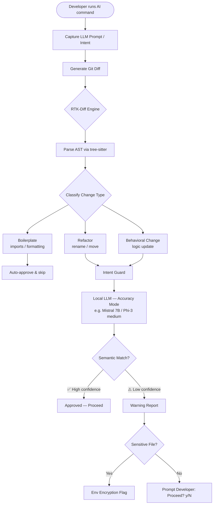
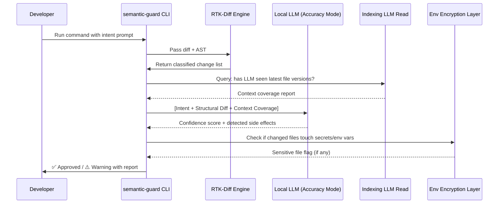
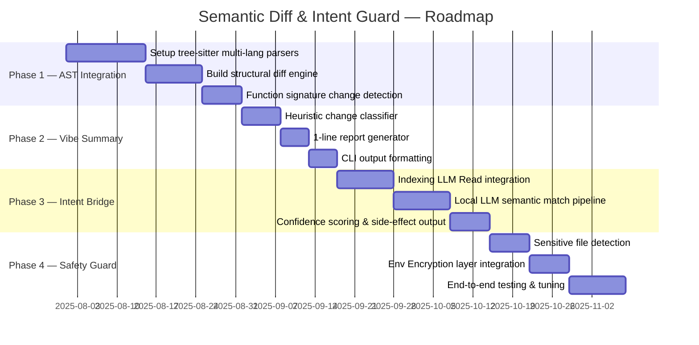
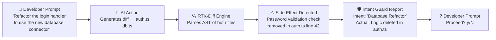

# Semantic Diff & Intent Guard
> A structural validation layer for vibe coders — inspired by the RTK (Rust Token Killer) architecture.

---

## 1. Overview

The **Semantic Diff & Intent Guard** is a **CLI tool** that sits between AI-generated code and your codebase. It intercepts diffs, parses them at the AST level, and runs an intent verification loop to ensure AI edits match what you actually asked for — without requiring you to manually read every changed line.

```
┌──────────────────────────────────────────────┐
│  Developer Intent (prompt / commit message)  │
└───────────────────┬──────────────────────────┘
                    │
                    ▼
         ┌──────────────────┐
         │  RTK-Diff Engine │  ← AST-level structural diff
         │  (tree-sitter)   │
         └────────┬─────────┘
                  │
                  ▼
         ┌──────────────────┐
         │  Intent Guard    │  ← Local LLM semantic match
         │  (accuracy mode) │
         └────────┬─────────┘
                  │
        ┌─────────┴──────────┐
        ▼                    ▼
   ✅ Approved           ⚠️ Warning
   (proceed)         (side-effect detected)
```

---

## 2. Core Objectives

| Goal | Description |
| :--- | :--- |
| **Reduce Cognitive Load** | Deliver 1-line "vibe checks" — no need to manually inspect every line of a diff |
| **Enhance Reliability** | Ensure high-speed AI edits match stated developer intent |
| **Token Efficiency** | RTK-inspired filtering keeps validation lightweight with `<100ms` overhead on the AST layer |

---

## 3. Language Support (Phase 1)

The following languages are supported at launch via `tree-sitter` grammars:

- **Rust** — `tree-sitter-rust`
- **TypeScript / JavaScript** — `tree-sitter-typescript`, `tree-sitter-javascript`
- **Python** — `tree-sitter-python`
- **Go** — `tree-sitter-go`

> Additional grammars (Java, C++, Ruby) can be registered as community plugins post-launch.

---

## 4. Technical Architecture

### System Flow



---

### A. Semantic Analysis Layer — The RTK-Diff Engine

Instead of a standard line-based `git diff`, this engine parses the **Abstract Syntax Tree (AST)** to identify _functional_ changes only.

**Change Classification:**

| Type | Definition | Action |
| :--- | :--- | :--- |
| `REFACTOR` | Renaming, moving logic, restructuring without behavioral change | Pass to Intent Guard |
| `BEHAVIORAL` | Logic updates, conditional changes, new/removed function bodies | Pass to Intent Guard |
| `BOILERPLATE` | Import statements, formatting, whitespace, comments | Auto-approve & skip |

**Implementation Details:**
- Parser: [`tree-sitter`](https://tree-sitter.github.io/tree-sitter/) with per-language grammars
- Filtering: Whitespace-only and comment-only diffs are discarded before reaching the LLM
- Output: Structured diff object — `{ file, changeType, affectedSymbols[], before_ast, after_ast }`

---

### B. The Intent Guard — Verification Loop

This module compares the **developer's stated intent** against the **structural code change**.



**Input:**
- LLM prompt (the developer's original intent)
- Structured diff from RTK-Diff Engine
- Context coverage report from the Indexing LLM Read tool

**Local LLM — Accuracy Mode:**
- Default model: `Mistral-7B-Instruct` or `Phi-3-medium`
- Latency: acceptable (accuracy is prioritized over speed)
- Runs fully local — no data leaves the machine
- Model is configurable via `~/.semantic-guard/config.toml`

**Output:**
```
confidence: 0.87
intent_match: true
side_effects:
  - "Password validation logic removed in auth.ts (line 42)"
sensitive_files: []
```

---

## 5. Implementation Phases



### Phase Details

| Phase | Name | Key Deliverable |
| :---: | :--- | :--- |
| **1** | **AST Integration** | `tree-sitter`-powered diff engine for Rust, TS/JS, Python, Go. Detects modified function signatures. |
| **2** | **Vibe Summary** | Heuristic reporter that classifies changes into a single human-readable line, e.g. `"Logic Update in 2 functions, 1 Refactor"`. |
| **3** | **Intent Bridge** | Integration with the Indexing LLM Read tool. Verifies the AI had sufficient context before making changes. Local LLM pipeline with confidence scoring. |
| **4** | **Safety Guard** | Sensitive file warnings via the Env Encryption layer. Flags any changes touching code that interacts with encrypted env vars or secrets. |

---

## 6. Example Workflow



**Terminal Output:**
```
$ semantic-guard check --intent "Refactor the login handler to use the new database connector"

[RTK-Diff]  auth.ts      → BEHAVIORAL  (2 functions modified)
[RTK-Diff]  db.ts        → REFACTOR    (connector swap)
[Indexer]   Context coverage: 100% (both files indexed)

[Intent Guard] Confidence: 0.71 ⚠️
  ↳ Intent matched: Database Refactor ✅
  ↳ Side effect:    Password validation logic DELETED in auth.ts:42 ❌

⚠️  Warning: Logic for 'Password Validation' was removed. This was NOT in your stated intent.

Proceed? [y/N]:
```

---

## 7. Integration with Existing Stack

### Indexing LLM Read
The Intent Guard queries the indexer before each validation to ensure the LLM has seen the **latest committed version** of every file it is modifying. If a file is stale in the index, the guard downgrades its confidence score and emits a context warning.

### Env Encryption Layer
Any diff touching a code block that reads, writes, or references encrypted environment variables or secrets will automatically be flagged as a **Sensitive File**. The tool will escalate the warning and require explicit confirmation before approving.

```
[Safety Guard] ⛔ SENSITIVE FILE DETECTED
  ↳ db.ts references: process.env.DB_SECRET_KEY (encrypted)
  ↳ Require explicit approval: type 'CONFIRM' to proceed
```

---

## 8. CLI Interface

```
Usage:
  semantic-guard check [flags]
  semantic-guard config
  semantic-guard index sync

Flags:
  --intent   <string>   The developer's intent / original prompt
  --diff     <file>     Path to a pre-generated diff file (default: git diff HEAD)
  --model    <string>   Override local LLM model (default: from config)
  --lang     <string>   Comma-separated language filter (rust,ts,py,go)
  --no-llm              Skip Intent Guard, run AST analysis only
  --yes                 Auto-approve non-sensitive, high-confidence changes
  --json                Output report as JSON

Config file: ~/.semantic-guard/config.toml
```

---

## 9. Non-Goals (v1)

- No remote/cloud LLM calls — all inference runs locally
- No UI or IDE plugin (CLI only in v1; VS Code extension is post-launch)
- No auto-revert — the guard warns but never automatically undoes a change
- No support for binary file diffs